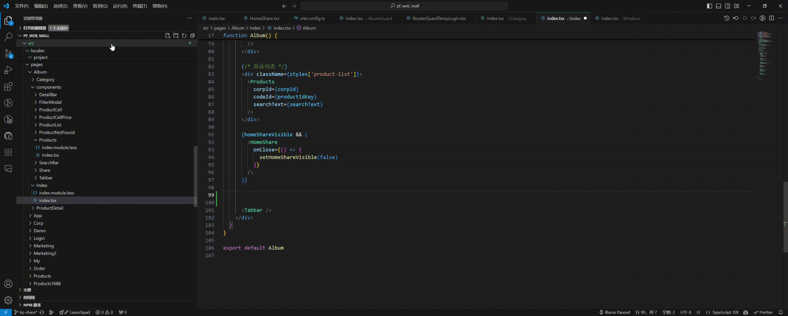
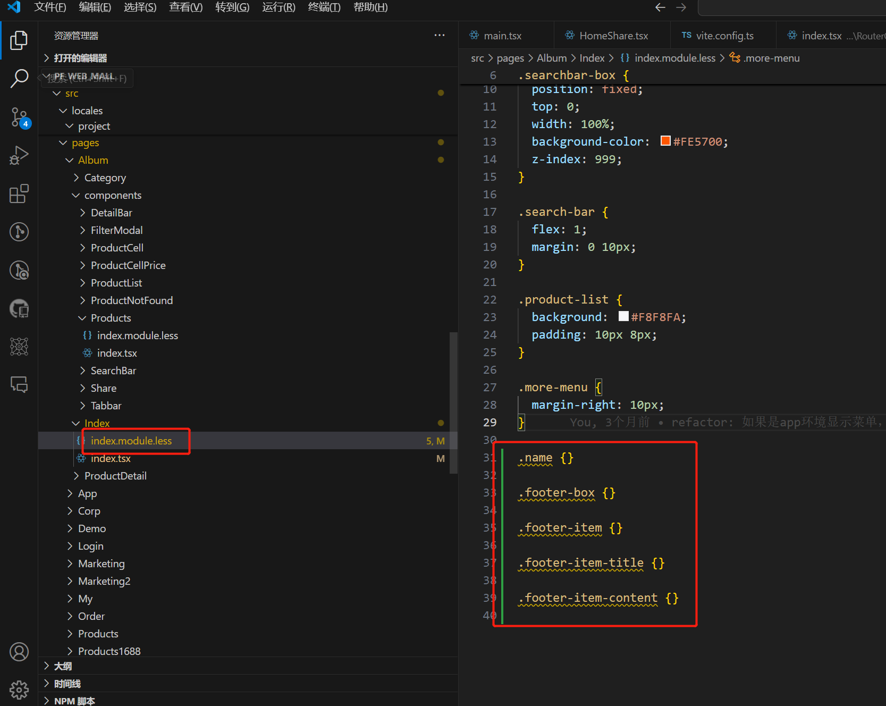

## 插件概述

`css-class-to-module`是一个把普通`className`转换为`css module styles`格式的`className`的插件。支持保存时转换和菜单指令转换。

## 功能

### 1、保存时，或者右键点击菜单，选择`class2module`转换。配合**Emmet**语法，在采用css module技术栈时，可以高效开发。

例如:

```
<div className="name"></div>
```

在按下保存键（ctrl+s）后，自动转换为：

```
<div className={styles['name']}></div>
```



### 2、如果样式文件不存在，自动引入样式文件，如果不存在该文件则自动创建。

在进行className转换后，需要用到styles变量，如果没有引入过该样式文件，则自动引入：

```
import styles from "./index.module.less";
```

如果不存在`./index.module.less`，则在同级目录自动创建。

### 3、布局里用到的类名，自动添加进同级目录的样式文件中。



## 插件设置

插件支持以下设置:

- `cssclass2module.supportedLanguageIds`: 插件支持的文件类型，默认`typescriptreact, javascriptreact`，即支持`jsx`和`tsx`。
- `cssclass2module.stylesName`: 自动引入样式文件时，样式变量名，默认是`styles`。
- `cssclass2module.stylesImportPath`：自动引入样式文件时，样式文件引入路径，默认是`./index.module.less`。
- `cssclass2module.isAddClassName`：`className`转换后，是否把新的类名添加进样式文件里，默认是`true`。

## 更新日志

### 1.0.0

插件初始化，添加自动转换类名、自动引入样式文件、自动添加类名进样式文件功能。

**Enjoy!**
